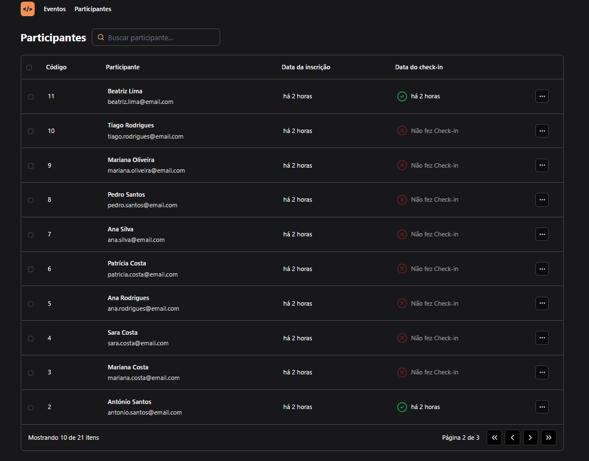
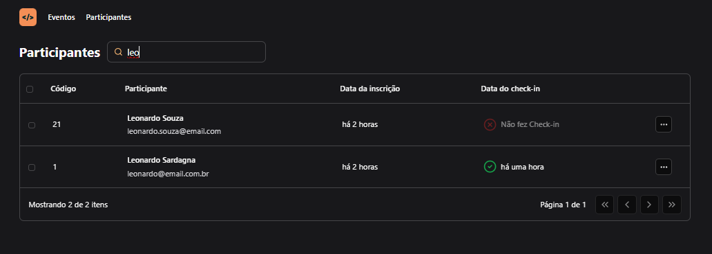

# Pass-In Event Manager (Front-End)

###

## Project

#### Main Screen



#### Participant Search



###

The Pass-In Event Manager application is a project developed during Next Level Week, an event by Rocketseat. Pass.in is an application for managing participants in in-person events. It uses ReactJS and Tailwind CSS to create a dynamic and visually appealing user experience. To access the backend of this application, visit [this repository.](https://github.com/LeonardoSardagna/NLW-Unite-server-NodeJS.git).

## Features

- Event Creation and Management: Allows users to create and manage events, including important details.
- Participant Management: Adds and manages participants, facilitating attendance control.
- Real-Time Check-In: Interface for checking in participants, updating their participation status instantly
- Advanced Filtering and Search: Search and filtering features to easily find participants.

## Technologies Used

- ReactJS: Creating an interactive user interface.
- Tailwind CSS: Responsive and modern design with a utility-first approach.
- TypeScript: Enhances code maintenance and scalability with static typing.

## Integrating Front-End and Back-End

For full functionality, you will need to set up and run the [back-end](https://github.com/LeonardoSardagna/NLW-Unite-server-NodeJS.git), which is responsible for all business logic, authentication, and database communication.

## How to Run

1. Clone the front-end repository:

```bash
git clone https://github.com/LeonardoSardagna/NLW-Unite-React.js.git
```
2. Install the dependencies:

```bash
npm i
```
3. Start the development server:

```bash
npm run dev
```
4. Follow the instructions in the [backend repository ](https://github.com/LeonardoSardagna/NLW-Unite-server-NodeJS.git) to set up and run the Node.js server.

5. Don't forget to configure the backend URL in the front-end .env file so that the application can communicate correctly.

```js
VITE_API_BASE_URL = "http://localhost:3333";
```

Front-End: [https://github.com/LeonardoSardagna/NLW-Unite-React.js.git](https://github.com/LeonardoSardagna/NLW-Unite-React.js.git)

Back-End: [https://github.com/LeonardoSardagna/NLW-Unite-server-NodeJS.git](https://github.com/LeonardoSardagna/NLW-Unite-server-NodeJS.git)
